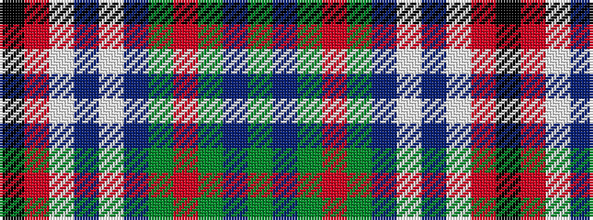

GBGRGBWBWRK

It is a 11 stripe tartan.

<figure class="pat-woven">

<figcaption>idealised sample</figcaption>
</figure>

## Colour Sequence



## Tartans with this colour sequence

| Tartans |
|---------------|
| [Downie Dress](/variants/s11/g3t3g5r4g28db8w3db3w24r2k2~x2/)|
||
