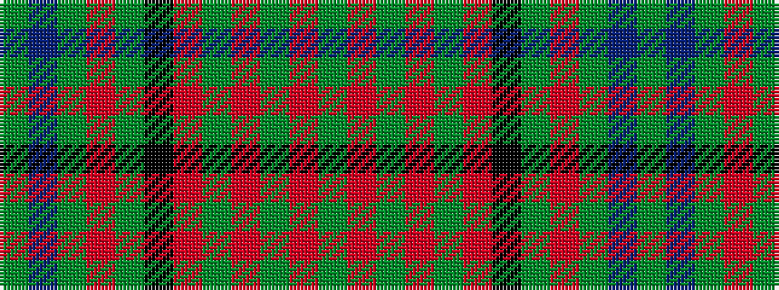

GBGRGKRGRGRG

It is a 12 stripe tartan.

<figure class="pat-woven">

<figcaption>idealised sample</figcaption>
</figure>

## Colour Sequence



## Tartans with this colour sequence

| Tartans |
|---------------|
| [MacDonald of Denovan Htg (Clan)](/setts/s12/dg10dp2dg3r4dg13k13r2g13r4g3r2g10~x2/)|
||
