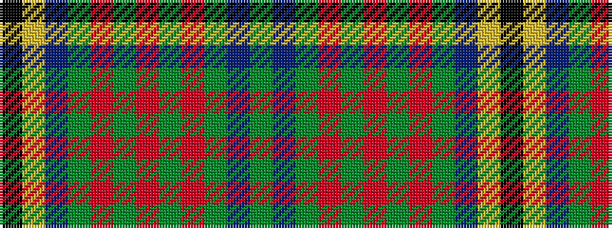

GBGRGRGRGBYK

It is a 12 stripe tartan.

<figure class="pat-woven">

<figcaption>idealised sample</figcaption>
</figure>

## Colour Sequence



## Tartans with this colour sequence

| Tartans |
|---------------|
| [Alasdair Dhana](/setts/s12/dg3dt20dg16r2dg2r3dg3r5dg16dt20ly1k2~x2/)|
||
