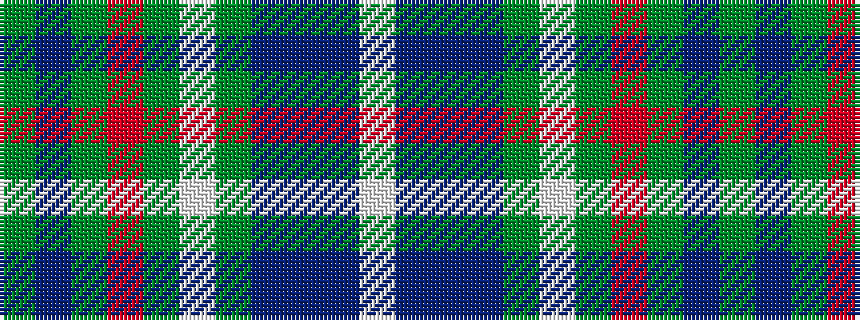

GBGRGWGBBBW

It is a 11 stripe tartan.

<figure class="pat-woven">

<figcaption>idealised sample</figcaption>
</figure>

## Colour Sequence



## Tartans with this colour sequence

| Tartans |
|---------------|
| [Spencer](/setts/s11/y40n3y8r2y2w2y10n6do2n2w2~x2/)|
||
