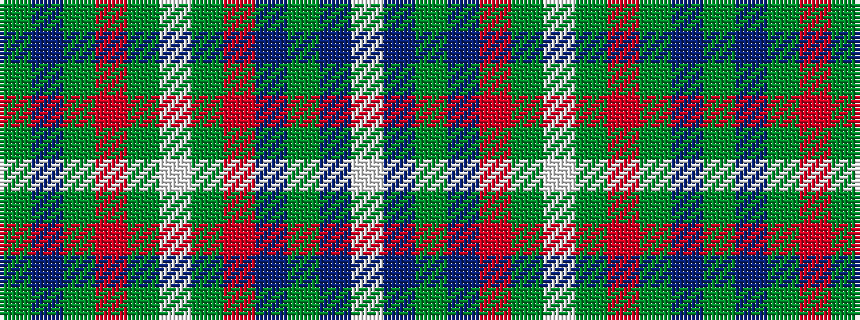

GBGRGWGRBGBW

It is a 12 stripe tartan.

<figure class="pat-woven">

<figcaption>idealised sample</figcaption>
</figure>

## Colour Sequence



## Tartans with this colour sequence

| Tartans |
|---------------|
| [Portree, Check](/setts/s12/y38db4y8o2y4w3y4m14n7y2n4w2~x2/)|
||
