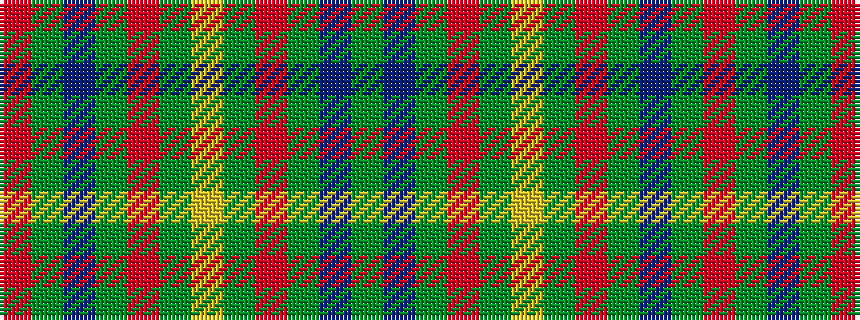

GBGRGYGRGBGR

It is a 12 stripe tartan.

<figure class="pat-woven">

<figcaption>idealised sample</figcaption>
</figure>

## Colour Sequence



## Tartans with this colour sequence

| Tartans |
|---------------|
| [Scottish Scouts #2](/setts/s12/g22db16g14r2g6lo2g6r2g14db16g22r3~x2/)|
||
