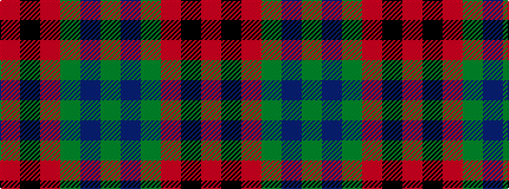

GBGRKR

It is a 6 stripe tartan.

<figure class="pat-woven">

<figcaption>idealised sample</figcaption>
</figure>

## Colour Sequence



## Tartans with this colour sequence

| Tartans |
|---------------|
| [Tulsa](/variants/s6/r14k3r14g13db8g13~x2/)|
||
| [Tulsa, City of](/variants/s6/dg14db8dg14r14k3r14~x2/)|
||
