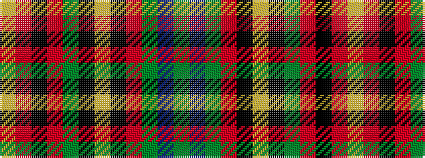

GBGRKYKGRKRY

It is a 12 stripe tartan.

<figure class="pat-woven">

<figcaption>idealised sample</figcaption>
</figure>

## Colour Sequence



## Tartans with this colour sequence

| Tartans |
|---------------|
| [Carroll O'Reed](/variants/s12/dg28b1dg4r1k1lr1k1g4r4k2r4lr2~x2/)|
||
