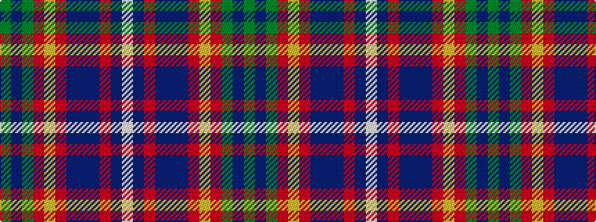

GBGRYRBBBRBW

It is a 12 stripe tartan.

<figure class="pat-woven">

<figcaption>idealised sample</figcaption>
</figure>

## Colour Sequence



## Tartans with this colour sequence

| Tartans |
|---------------|
| [Wcwm 1243](/variants/s12/g3db1g6r6lo1r6n6db1n6r2n6lb1~x4/)|
||
