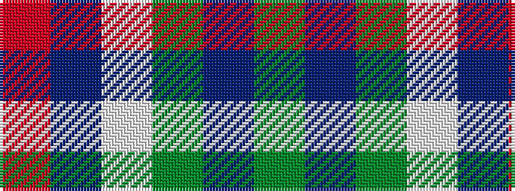

GBGWBR

It is a 6 stripe tartan.

<figure class="pat-woven">

<figcaption>idealised sample</figcaption>
</figure>

## Colour Sequence



## Tartans with this colour sequence

| Tartans |
|---------------|
| [Norris (1957)](/variants/s6/g6b1g7w1b7r1~x4/)|
||
