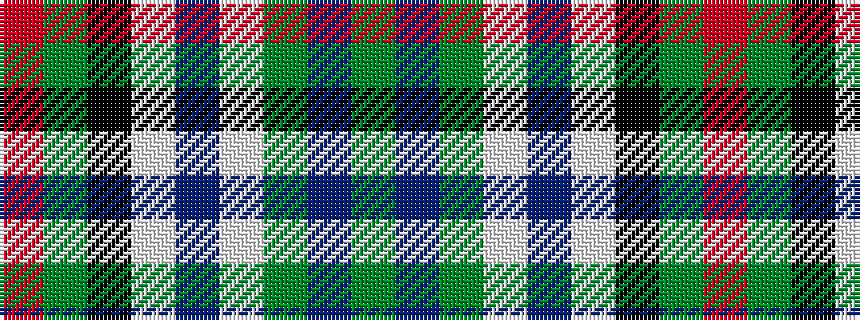

GBGWBWKGR

It is a 9 stripe tartan.

<figure class="pat-woven">

<figcaption>idealised sample</figcaption>
</figure>

## Colour Sequence



## Tartans with this colour sequence

| Tartans |
|---------------|
| [Vorwerk, The](/setts/s9/g40db8g8lp8db5lp13k9g40r4/)|
||
