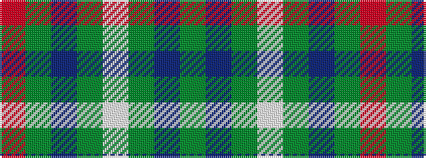

GBGWGBGR

It is a 8 stripe tartan.

<figure class="pat-woven">

<figcaption>idealised sample</figcaption>
</figure>

## Colour Sequence



## Tartans with this colour sequence

| Tartans |
|---------------|
| [Simple Technology](/setts/s8/g28db9dg18w3dg18db9g28r3~x2/)|
||
