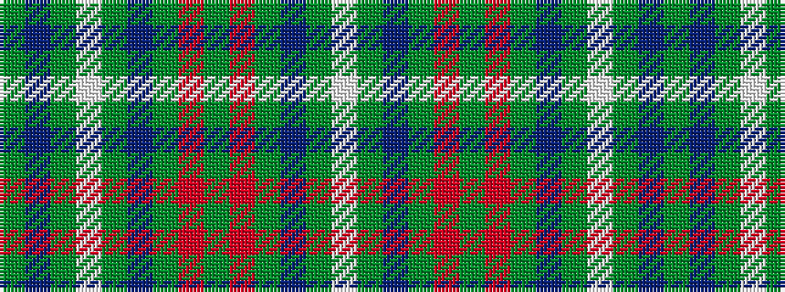

GBGWGBGRGRGBGW

It is a 14 stripe tartan.

<figure class="pat-woven">

<figcaption>idealised sample</figcaption>
</figure>

## Colour Sequence



## Tartans with this colour sequence

| Tartans |
|---------------|
| [Glenlivet Dress Reproduction](/setts/s14/w16dy5db2dy42r2dy6r2dy42db2dy5w16dy5db2dy5~x2/)|
||
