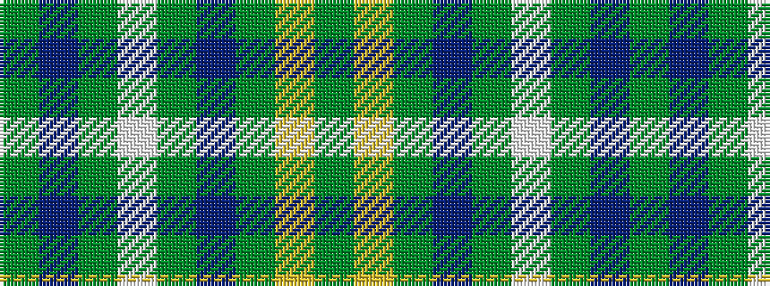

GBGWGBGYG

It is a 9 stripe tartan.

<figure class="pat-woven">

<figcaption>idealised sample</figcaption>
</figure>

## Colour Sequence



## Tartans with this colour sequence

| Tartans |
|---------------|
| [Rutlin (Personal)](/variants/s9/y6db2y1w17y1db2y16lo27dg2~x2/)|
||
