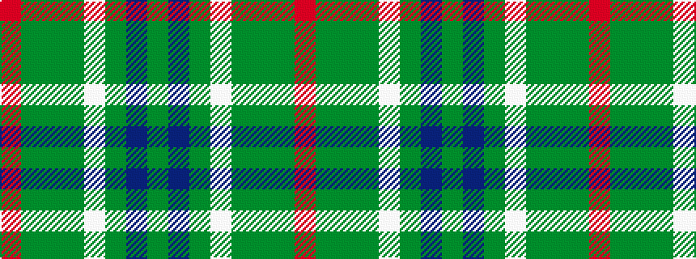

GBGWGGGR

It is a 8 stripe tartan.

<figure class="pat-woven">

<figcaption>idealised sample</figcaption>
</figure>

## Colour Sequence



## Tartans with this colour sequence

| Tartans |
|---------------|
| [Burnett of Leys Hunting Family Tartan](/variants/s8/dy96db8dy8w3dy8g3dy8r3~x2/)|
||
