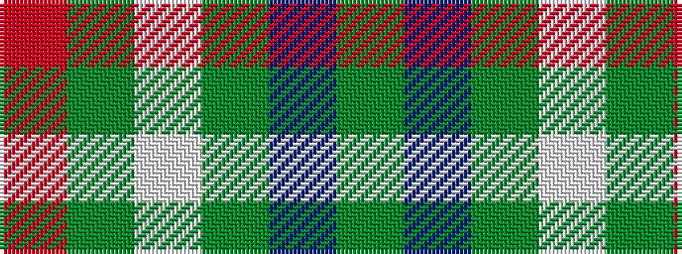

GBGWGR

It is a 6 stripe tartan.

<figure class="pat-woven">

<figcaption>idealised sample</figcaption>
</figure>

## Colour Sequence



## Tartans with this colour sequence

| Tartans |
|---------------|
| [Annapolis Valley](/setts/s6/g30b8g5lb4g5r1~x4/)|
||
| [Annapolis Valley](/setts/s6/g30t8g5lb4g5r2~x4/)|
||
