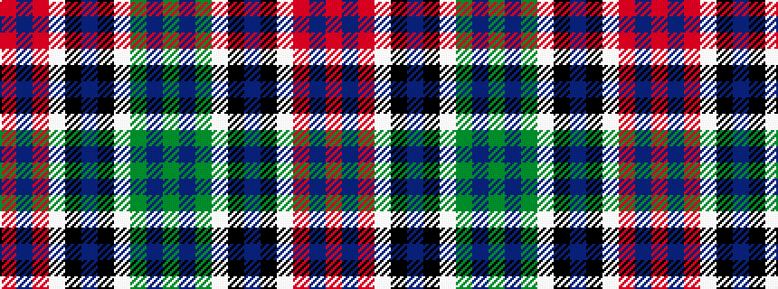

GBGWKBKWRBR

It is a 11 stripe tartan.

<figure class="pat-woven">

<figcaption>idealised sample</figcaption>
</figure>

## Colour Sequence



## Tartans with this colour sequence

| Tartans |
|---------------|
| [MacMichael](/variants/s11/r1db1r8w1k2db16k2w1g8db1g1~x2/)|
||
| [MacMichael](/variants/s11/r1db1r8lb1k2db16k2lb1g8db1g1~x4/)|
||
