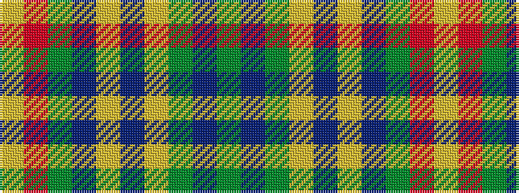

GBGYBYBGRY

It is a 10 stripe tartan.

<figure class="pat-woven">

<figcaption>idealised sample</figcaption>
</figure>

## Colour Sequence



## Tartans with this colour sequence

| Tartans |
|---------------|
| [Rikaco Eve (Fashion)](/setts/s10/g4n4g2lo36n14lo2t4g7r5lo3~x2/)|
||
