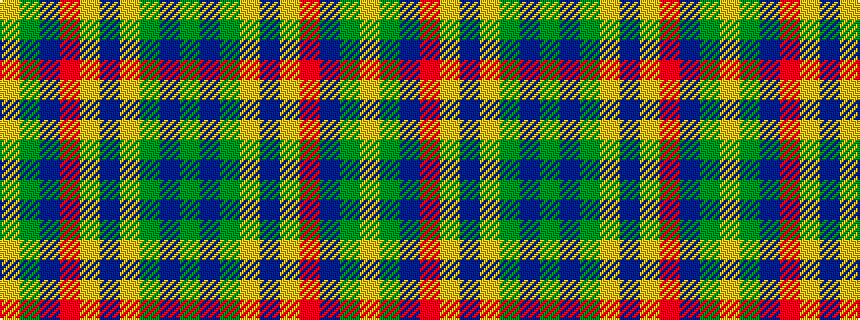

GBGYBYRBGY

It is a 10 stripe tartan.

<figure class="pat-woven">

<figcaption>idealised sample</figcaption>
</figure>

## Colour Sequence



## Tartans with this colour sequence

| Tartans |
|---------------|
| [Antrim Irish County Tartan](/variants/s10/g5dt2g17ly2db5ly2r5db17g2ly4~x2/)|
||
| [Antrim, County](/variants/s10/y5dt2y18lo2dt5lo2o5dt17y2lo4~x2/)|
||
