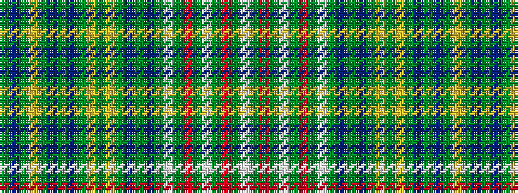

GBGYGBGBGYGYGBGBGWGRGWGRGW

It is a 26 stripe tartan.

<figure class="pat-woven">

<figcaption>idealised sample</figcaption>
</figure>

## Colour Sequence



## Tartans with this colour sequence

| Tartans |
|---------------|
| [Sprouston](/setts/s26/dy3b12g6ly3g6b12dy3b12g6ly3g6ly3g6b12dy6b12dy3w1dy3r3dy3w1dy3r3dy3w1~x2/)|
||
