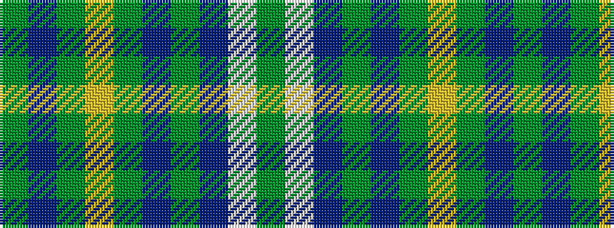

GBGYGBGBWG

It is a 10 stripe tartan.

<figure class="pat-woven">

<figcaption>idealised sample</figcaption>
</figure>

## Colour Sequence



## Tartans with this colour sequence

| Tartans |
|---------------|
| [Burns Battalion (Fashion)](/setts/s10/dy22b2dy3ly4dy3b2dy12b4w19dy3~x2/)|
||
