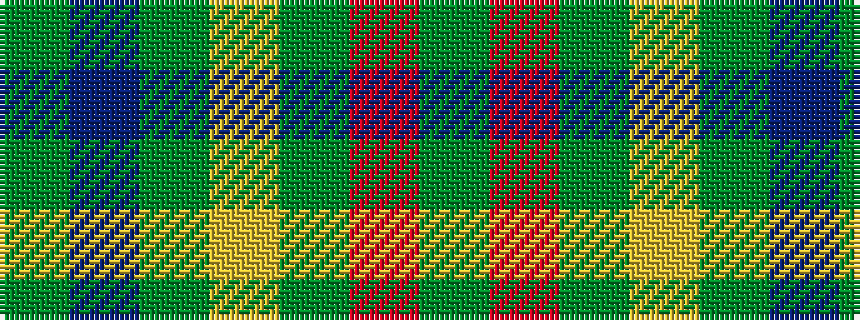

GBGYGRG

It is a 7 stripe tartan.

<figure class="pat-woven">

<figcaption>idealised sample</figcaption>
</figure>

## Colour Sequence



## Tartans with this colour sequence

| Tartans |
|---------------|
| [Shannon (?)](/setts/s7/dy48dp11g16ly16dy11r3dy11~x2/)|
||
