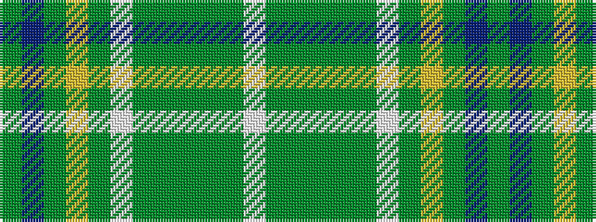

GBGYGWGGGGGW

It is a 12 stripe tartan.

<figure class="pat-woven">

<figcaption>idealised sample</figcaption>
</figure>

## Colour Sequence



## Tartans with this colour sequence

| Tartans |
|---------------|
| [Stuart/Stewart Silver](/variants/s12/y60t5y8ly2y4w2y4dg16dy8y2dy4w2~x2/)|
||
