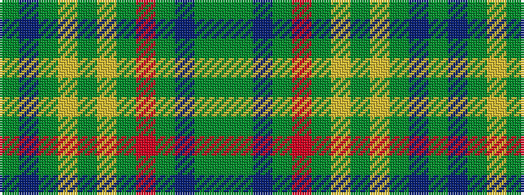

GBGYGYGRGBGG

It is a 12 stripe tartan.

<figure class="pat-woven">

<figcaption>idealised sample</figcaption>
</figure>

## Colour Sequence



## Tartans with this colour sequence

| Tartans |
|---------------|
| [Harmony, 2 & 3](/setts/s12/dg11t3dg4ly3dg3ly4dg3o13g3t3g4dg3~x2/)|
||
