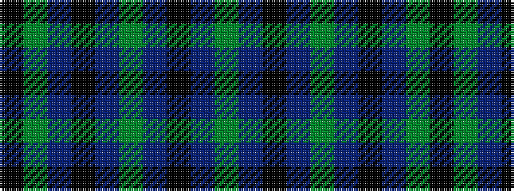

GBKBGBKBGK

It is a 10 stripe tartan.

<figure class="pat-woven">

<figcaption>idealised sample</figcaption>
</figure>

## Colour Sequence



## Tartans with this colour sequence

| Tartans |
|---------------|
| [Norwich No.049](/variants/s10/g9t1k6t4g2t4k6t1g9k2~x2/)|
||
