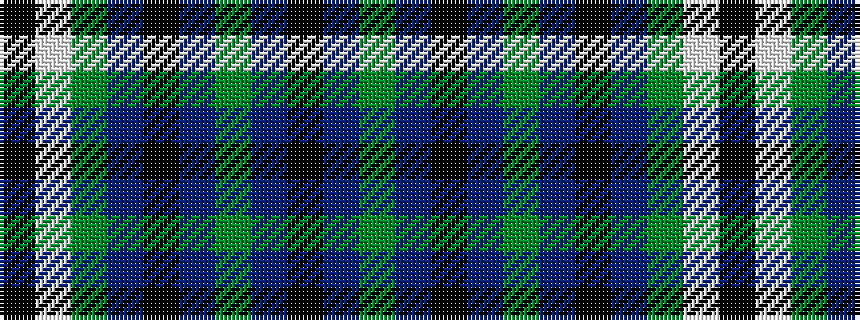

GBKBGBKBGWK

It is a 11 stripe tartan.

<figure class="pat-woven">

<figcaption>idealised sample</figcaption>
</figure>

## Colour Sequence



## Tartans with this colour sequence

| Tartans |
|---------------|
| [Wilson's, No 149](/setts/s11/k8w2g11t2k2t2g11db6k2db6g8~x2/)|
||
