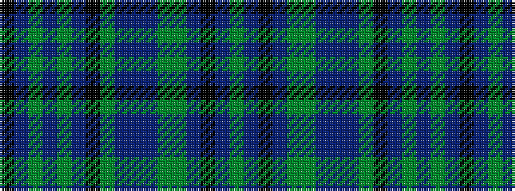

GBKBGGBBBGKBGBGBK

It is a 17 stripe tartan.

<figure class="pat-woven">

<figcaption>idealised sample</figcaption>
</figure>

## Colour Sequence



## Tartans with this colour sequence

| Tartans |
|---------------|
| [National Trust for Scotland](/setts/s17/dg13db2k2db2dg13y4db14dp2db14y4k12db2dg2db2dg2db2k12~x2/)|
||
