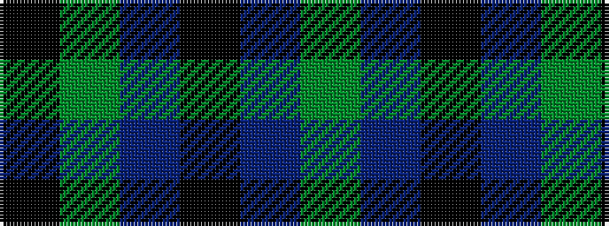

GBKBGK

It is a 6 stripe tartan.

<figure class="pat-woven">

<figcaption>idealised sample</figcaption>
</figure>

## Colour Sequence



## Tartans with this colour sequence

| Tartans |
|---------------|
| [Lennie](/setts/s6/k2g10t2k9p8g2~x2/)|
||
| [Lennie Family Tartan Tartan Number: 725. Earliest known date: 1819 Wilson's No 231. See products available Copyright © Blair Urquhart, Comrie, 2015](/setts/s6/k2g10t2k9dp8g2~x2/)|
||
| [Unidentified #28](/setts/s6/k2dg9t1k6b4dg2~x2/)|
||
| [Unnamed 3](/setts/s6/k2g9t1k6b4g2~x2/)|
||
