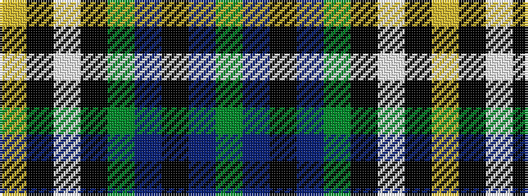

GBKBGKWKY

It is a 9 stripe tartan.

<figure class="pat-woven">

<figcaption>idealised sample</figcaption>
</figure>

## Colour Sequence



## Tartans with this colour sequence

| Tartans |
|---------------|
| [Smoke Showing (UFES)](/setts/s9/g3n5k4n33g12k4w2k18lo3~x2/)|
||
