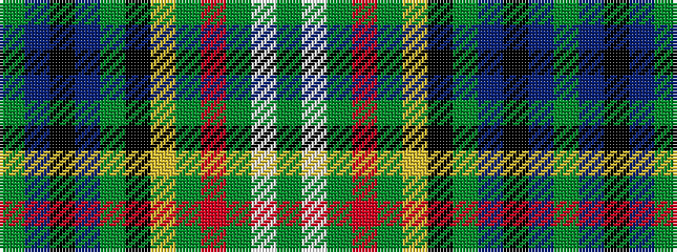

GBKBGKYGRGWG

It is a 12 stripe tartan.

<figure class="pat-woven">

<figcaption>idealised sample</figcaption>
</figure>

## Colour Sequence



## Tartans with this colour sequence

| Tartans |
|---------------|
| [Forfar Farmington](/variants/s12/dg5w3dg15r3dg15ly3k10dg19db3k3db3dg3~x2/)|
||
