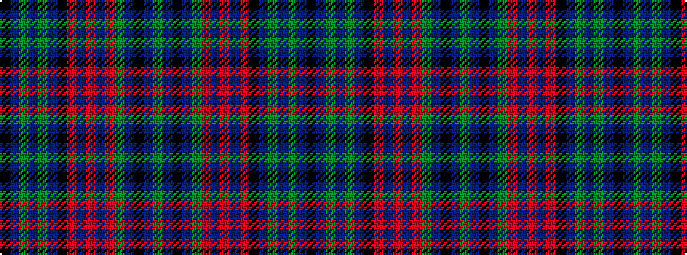

GBKBGRBRBRKBGBGBK

It is a 17 stripe tartan.

<figure class="pat-woven">

<figcaption>idealised sample</figcaption>
</figure>

## Colour Sequence



## Tartans with this colour sequence

| Tartans |
|---------------|
| [Lumsden Green](/setts/s17/k16db2g2db2g2db2k16r3dbi15r2dbi15r3g16db2k2db2g16~x2/)|
||
| [Lumsden Hunting](/setts/s17/dg34db2k2db2dg34r3db34r2db34r3k33db2dg2db2dg2db2k33~x2/)|
||
