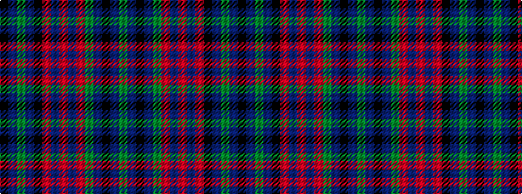

GBKBGRBRBRKBGBK

It is a 15 stripe tartan.

<figure class="pat-woven">

<figcaption>idealised sample</figcaption>
</figure>

## Colour Sequence



## Tartans with this colour sequence

| Tartans |
|---------------|
| [Lumsden Green](/variants/s15/k14db2g2db2k14r2db12r2db12r2g13db2k2db2g14~x2/)|
||
