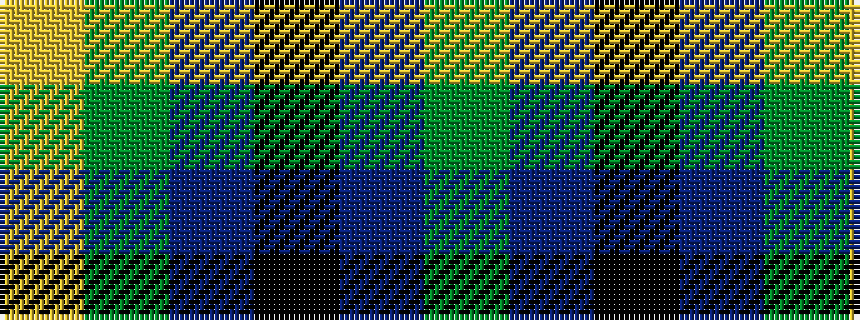

GBKBGY

It is a 6 stripe tartan.

<figure class="pat-woven">

<figcaption>idealised sample</figcaption>
</figure>

## Colour Sequence



## Tartans with this colour sequence

| Tartans |
|---------------|
| [Jack, John (Fife) (Personal)](/variants/s6/y4dr52k20do9y2lo1~x2/)|
||
