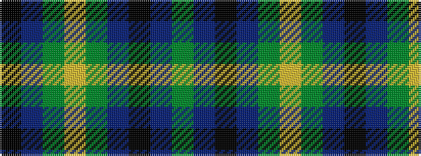

GBKBGYGBK

It is a 9 stripe tartan.

<figure class="pat-woven">

<figcaption>idealised sample</figcaption>
</figure>

## Colour Sequence



## Tartans with this colour sequence

| Tartans |
|---------------|
| [Dewar, Robert Alexander](/setts/s9/dg15dt8k5dt8dg15ly3dg15dt8k5~x2/)|
||
| [Dewar, Robert Alexander (Personal)](/setts/s9/g15dt8k5dt8g15ly3g15dt8k5~x2/)|
||
