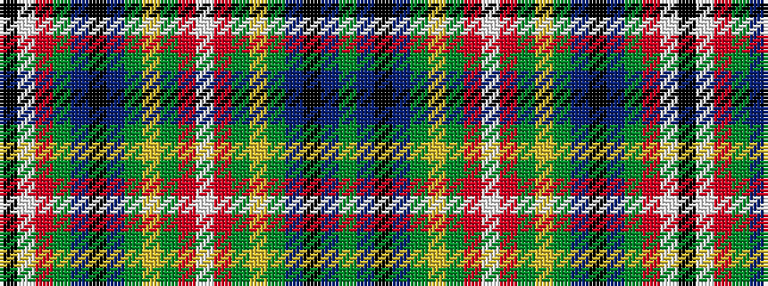

GBKBGYGRWRGYGBKBGRWK

It is a 20 stripe tartan.

<figure class="pat-woven">

<figcaption>idealised sample</figcaption>
</figure>

## Colour Sequence



## Tartans with this colour sequence

| Tartans |
|---------------|
| [Wcwm 9275-1572-1](/variants/s20/g112dp2k4dp2g6lo1g2r2lb2r2g2lo1g6dp2k4dp2g6r2lb6k4~x2/)|
||
