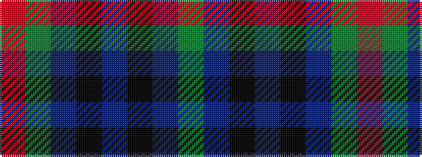

GBKBKBGR

It is a 8 stripe tartan.

<figure class="pat-woven">

<figcaption>idealised sample</figcaption>
</figure>

## Colour Sequence



## Tartans with this colour sequence

| Tartans |
|---------------|
| [Wilson's No.137](/setts/s8/g6dp3k3dp3k3dp3g6r2~x2/)|
||
