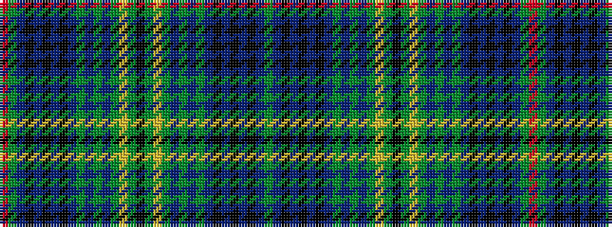

GBKBKBKBGBGBGYGKGYGBGBGBKBKBKBGR

It is a 32 stripe tartan.

<figure class="pat-woven">

<figcaption>idealised sample</figcaption>
</figure>

## Colour Sequence



## Tartans with this colour sequence

| Tartans |
|---------------|
| [Kennedy #3](/setts/s32/g24dt4k3dt3k3dt3k3dt4g12dp2g2dp2g3lo2g2k2g2lo2g3dp2g2dp2g12dt4k3dt3k3dt3k3dt4g24r3~x2/)|
||
