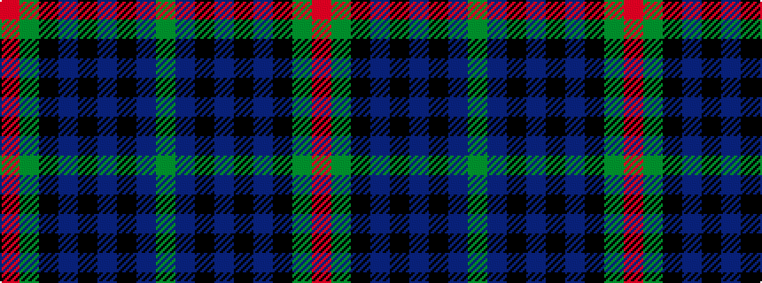

GBKBKBKGR

It is a 9 stripe tartan.

<figure class="pat-woven">

<figcaption>idealised sample</figcaption>
</figure>

## Colour Sequence



## Tartans with this colour sequence

| Tartans |
|---------------|
| [MacWilliams Wedding Personal Tartan](/variants/s9/r2g10ki12n1k2n14ki1n1g2~x2/)|
||
| [McWilliams Wedding (Personal)](/variants/s9/r2g10ki12db1k2db14ki1db1g2~x2/)|
||
