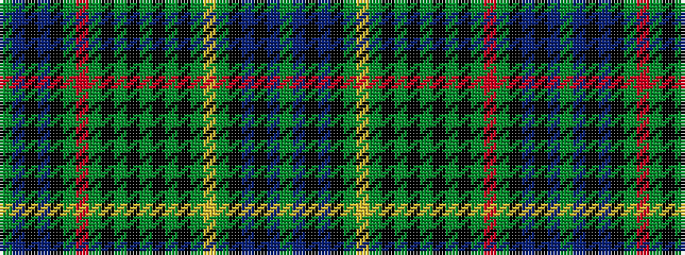

GBKBKGRGKGKGKGKGYGKBKBG

It is a 23 stripe tartan.

<figure class="pat-woven">

<figcaption>idealised sample</figcaption>
</figure>

## Colour Sequence



## Tartans with this colour sequence

| Tartans |
|---------------|
| [Stewart Hunting Early](/setts/s23/dg2db4k1db1k3dg12r2dg12k3dg2k6dg2k6dg2k3dg12ly2dg12k4db1k1db3dg2/)|
||
| [Stewart Hunting Early](/setts/s23/dg4db9k3db3k8dg27r4dg27k8dg5k13dg4k13dg5k8dg27ly4dg27k8db3k3db9dg4~x2/)|
||
| [Stewart Hunting Early](/setts/s23/dg4db9k3db3k8dg27r8dg27k8dg5k13dg8k13dg5k8dg27ly8dg27k8db3k3db9dg4/)|
||
