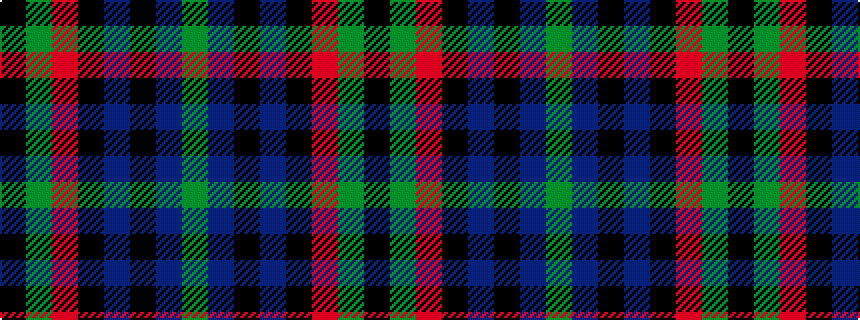

GBKBKRGK

It is a 8 stripe tartan.

<figure class="pat-woven">

<figcaption>idealised sample</figcaption>
</figure>

## Colour Sequence



## Tartans with this colour sequence

| Tartans |
|---------------|
| [Brabender](/variants/s8/k1g4r1k4db1k1db7g1~x6/)|
||
