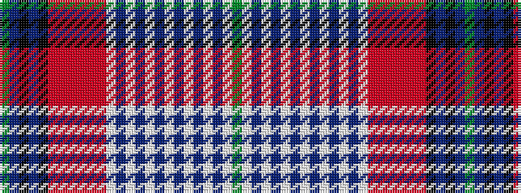

GBKBKRRRRRRWBWBWBWBWBWBWG

It is a 25 stripe tartan.

<figure class="pat-woven">

<figcaption>idealised sample</figcaption>
</figure>

## Colour Sequence



## Tartans with this colour sequence

| Tartans |
|---------------|
| [A J Gallacher](/setts/s25/g3w1b4w1b3w2b3w2b2w3b2w3b1w4r20r1r1r1r1r7k3b1k1b1g2~x2/)|
||
