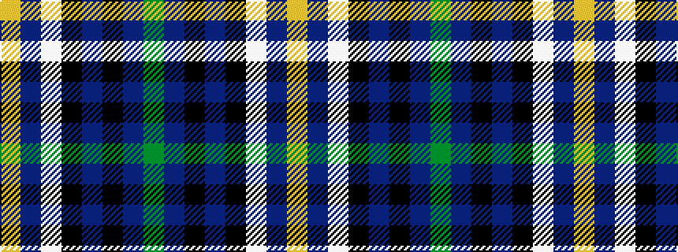

GBKBKWBY

It is a 8 stripe tartan.

<figure class="pat-woven">

<figcaption>idealised sample</figcaption>
</figure>

## Colour Sequence



## Tartans with this colour sequence

| Tartans |
|---------------|
| [Binder Wedding (Personal)](/setts/s8/g1b1k1b30k30w2b5lo1~x2/)|
||
| [Binder Wedding (Personal)](/setts/s8/g1db1k1db30k30w2db5ly1~x2/)|
||
