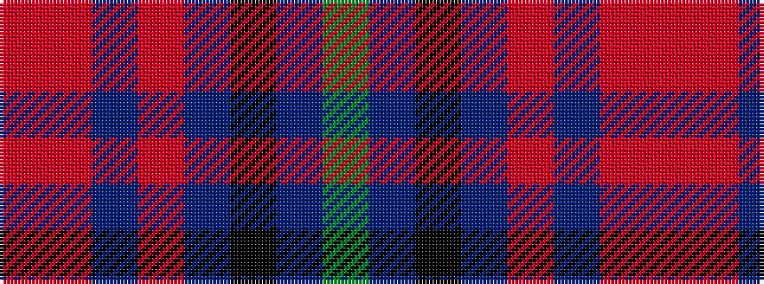

GBKBRBRR

It is a 8 stripe tartan.

<figure class="pat-woven">

<figcaption>idealised sample</figcaption>
</figure>

## Colour Sequence



## Tartans with this colour sequence

| Tartans |
|---------------|
| [Harrower, John Anthony (Personal)](/setts/s8/dg8db5k1db17r10db2r10o2~x2/)|
||
