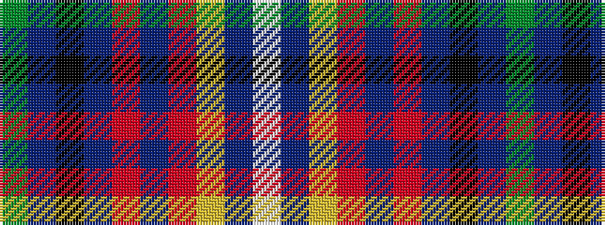

GBKBRBRYBW

It is a 10 stripe tartan.

<figure class="pat-woven">

<figcaption>idealised sample</figcaption>
</figure>

## Colour Sequence



## Tartans with this colour sequence

| Tartans |
|---------------|
| [Bro-Naoned](/setts/s10/g5dt2k2dt29r2dt2r15ly2dt4w2~x2/)|
||
