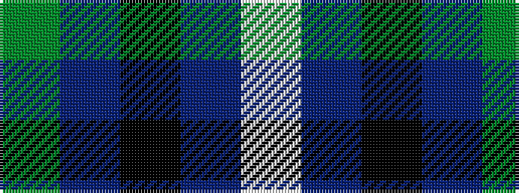

GBKBW

It is a 5 stripe tartan.

<figure class="pat-woven">

<figcaption>idealised sample</figcaption>
</figure>

## Colour Sequence



## Tartans with this colour sequence

| Tartans |
|---------------|
| [Irvine](/setts/s5/g18db9k1db1w1~x4/)|
||
| [Irvine of Drum (Clan)](/setts/s5/g49t21k3t3w3~x2/)|
||
