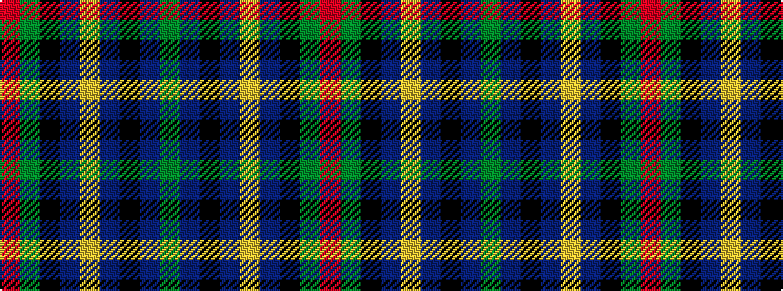

GBKBYBKGR

It is a 9 stripe tartan.

<figure class="pat-woven">

<figcaption>idealised sample</figcaption>
</figure>

## Colour Sequence



## Tartans with this colour sequence

| Tartans |
|---------------|
| [McWilliams Wedding (Personal)](/variants/s9/r2g10k12n1ly2n14k1n1g2~x2/)|
||
