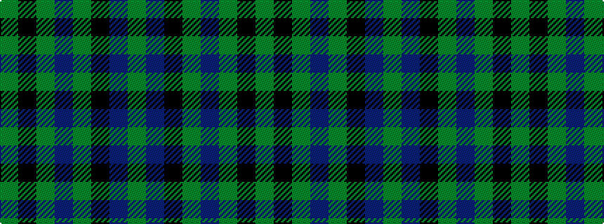

GBKGBGKG

It is a 8 stripe tartan.

<figure class="pat-woven">

<figcaption>idealised sample</figcaption>
</figure>

## Colour Sequence



## Tartans with this colour sequence

| Tartans |
|---------------|
| [City of Guelph](/variants/s8/g28k4g5dr4g5k19db19y2~x2/)|
||
