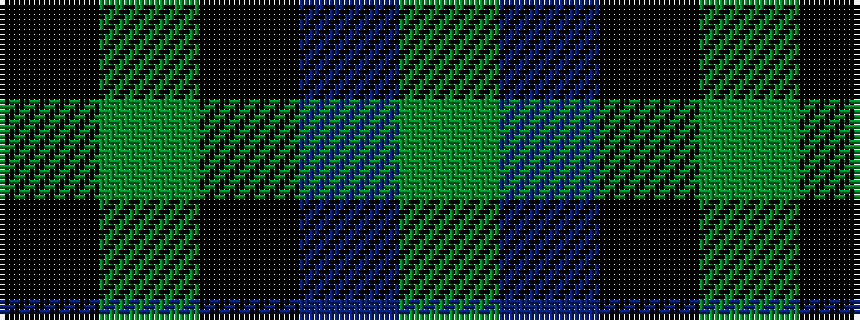

GBKGK

It is a 5 stripe tartan.

<figure class="pat-woven">

<figcaption>idealised sample</figcaption>
</figure>

## Colour Sequence



## Tartans with this colour sequence

| Tartans |
|---------------|
| [Unidentified #29](/setts/s5/k5dg14k16db12dg4~x2/)|
||
| [Unnamed 1](/setts/s5/k5g14k16db12g4~x2/)|
||
