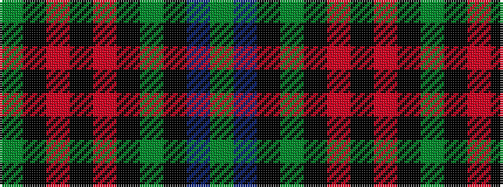

GBKGKRKRKG

It is a 10 stripe tartan.

<figure class="pat-woven">

<figcaption>idealised sample</figcaption>
</figure>

## Colour Sequence



## Tartans with this colour sequence

| Tartans |
|---------------|
| [Arizona Jones](/variants/s10/g18k1r9k12r9k1g18k1n6g1~x2/)|
||
| [Jones (Arizona) (Name)](/variants/s10/dg18k1r9k12r9k1dg18k1n6dg1~x2/)|
||
