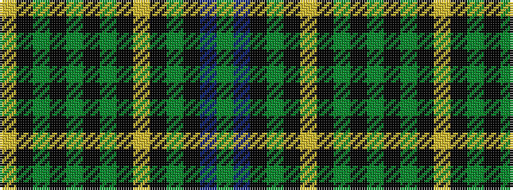

GBKGKYKGKGKGKY

It is a 14 stripe tartan.

<figure class="pat-woven">

<figcaption>idealised sample</figcaption>
</figure>

## Colour Sequence



## Tartans with this colour sequence

| Tartans |
|---------------|
| [Hopetoun Rejected design](/setts/s14/dg11db1k1dg2k12ly1k12dg2k2dg11k2dg2k12ly1~x4/)|
||
| [Hopetoun, Rejected design](/setts/s14/g11db1k1g2k12ly1k12g2k2g11k2g2k12ly1~x4/)|
||
